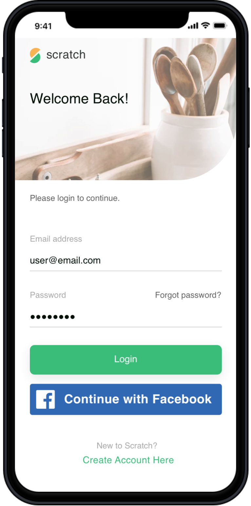
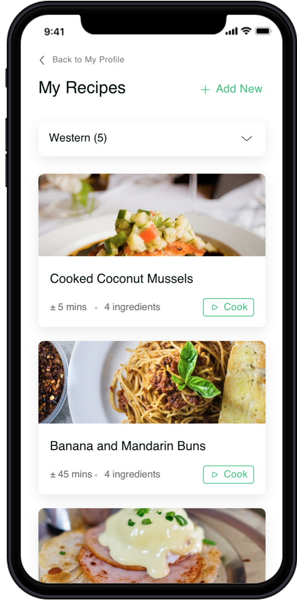
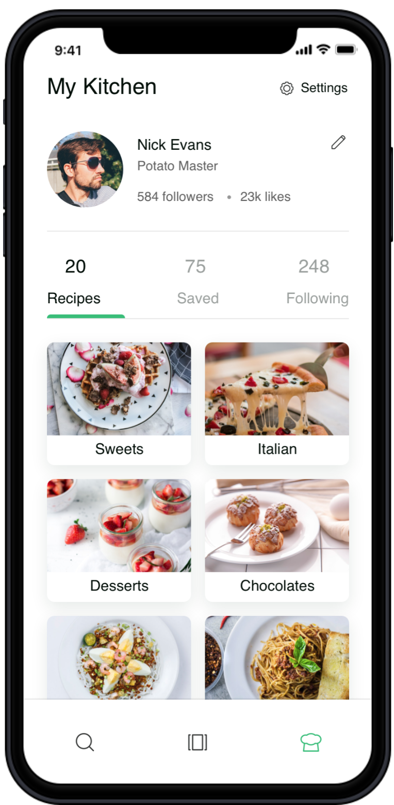
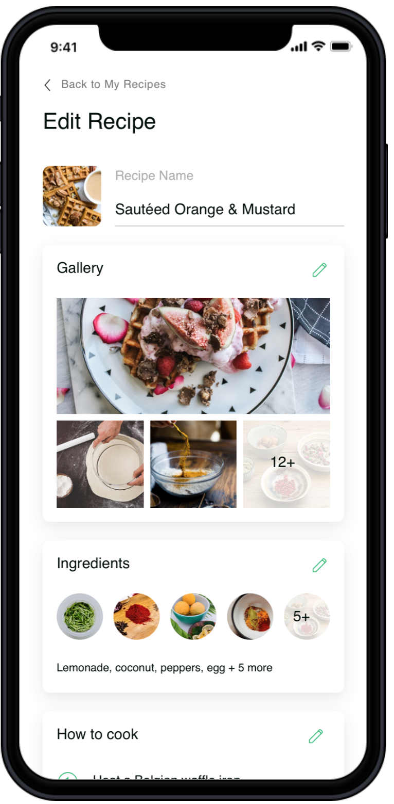
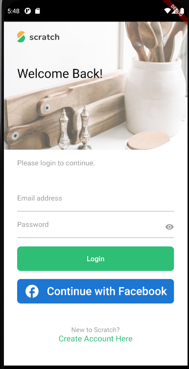
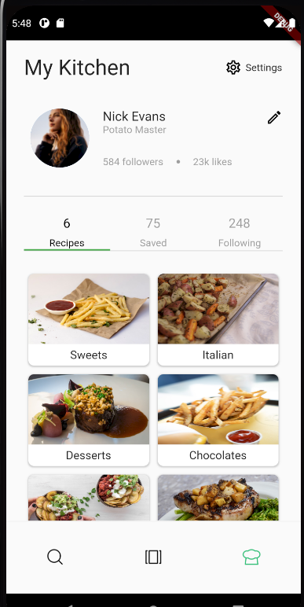
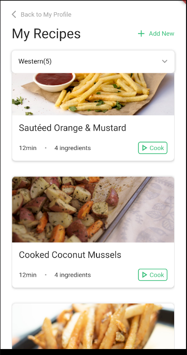
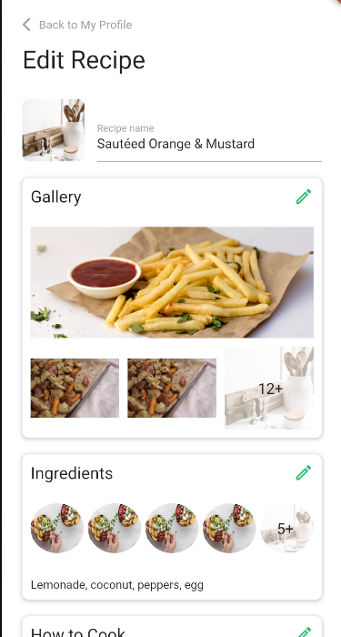
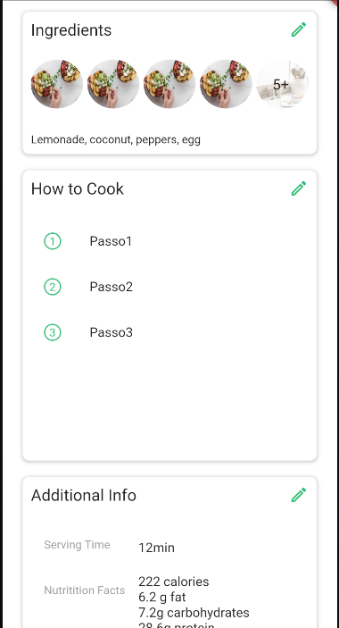
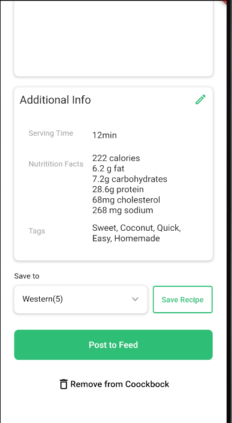

# app-flutter

Tela 1:

Tela 2:

Tela 3:

Tela 4:

Acesso utilizando credenciais:

Login: rafaellevissa@gmail.com
Senha: senha123

OBS: Para efetuar o logo basta clicar no botão settings localizado na home.

APK:

[apk](./app-release.apk)

Telas concluidas:

Login:

Home:

MyRecipe:

Edit Recipe:

